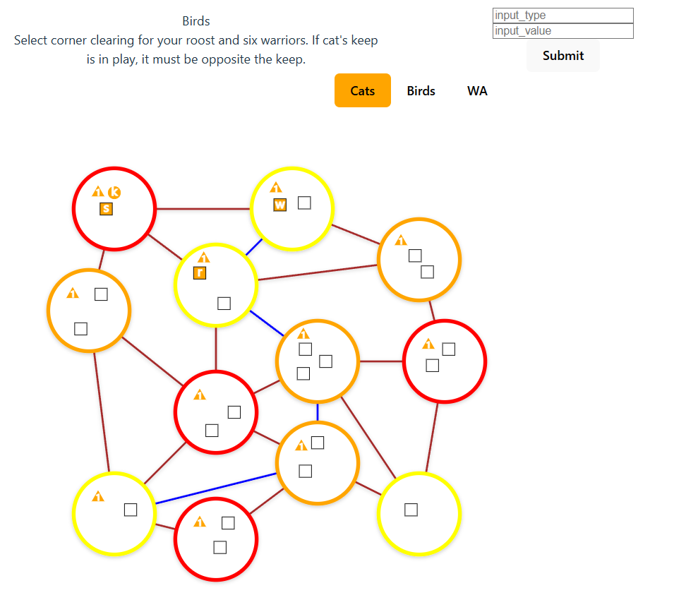

Table of Contents
- [Introduction](#introduction)
  - [Tech Stack and design philosophy](#tech-stack-and-design-philosophy)
    - [Project Structure](#project-structure)
    - [Action Flow](#action-flow)
  - [State of the Project](#state-of-the-project)
# Introduction

This is a web-based adaptation of the board game Root by Cole Wehrle. Root is a complex board game with many different factions, each with their own unique rules and mechanics.

The eventual aim is to implement all current factions and one day, maybe fan-made factions as well.

## Tech Stack and design philosophy
This project is built using Python 3.10 and Django 4.0. The frontend is built using React 18 using Tanstack Query for interaction with the API.
 
Eventually, django-channels backed by Redis will be used to allow for real-time updates.
 
The project is designed such that the server handles all game logic and the frontend handles all user interaction. The frontend will not be responsible for any game logic, as that would mean duplicating the logic in the frontend and backend in different languages, which is hard to maintain and likely to lead to bugs and inconsistencies.

### Project Structure
<ul>
<li>The database will hold all state for the game, which is defined in the models module.</li>
<li>The queries module holds logic that queries the database, but does not modify it.</li>
<li>The transactions module holds logic that modifies the database, checking for game state using queries.</li>
<li> views provide gamestate information and post methods to submit moves. These moves are validated (with queries) and then executed using transactions.</li>
</ul>

### Action Flow
<ul>
<li>The client requests the endpoint corresponding to the current action step, which may be a step of a player's turn, or resolving their part of an event like battle.</li>

<li>
That endpoint will return a JSON object with the next action step to take and the data the client should send.</li>
<li>
When the user interacts with the UI, the client sends a POST request to the endpoint corresponding to the action step. If it is a multistep process, the server will validate the first step and send back the next one, or provide the error if the first step is invalid. This continues until the server sends back a "completed" step.
</li>
<li>
If the server sends back a "completed" step, the client will know that the action is complete. The client again requests the endpoint corresponding to the next action step, and the cycle repeats.
<li>
Validation of timing and player making requests is handled by the custom GameActionView base class. Anything corresponding to a player action is subclassed from this class.
</li>
</ul>

## State of the Project
Currently, Cats, Birds, and Woodland Alliance are partially implemented.
All three can execute setup.
Cats can execute all phases of their turn.
Birds are in progress.

The frontend is very minimal, but will be augmented over time. Currently it is doing just enough to
allow players to receive prompts and to take actions. The frontend cannot create games just yet, though the API can.

