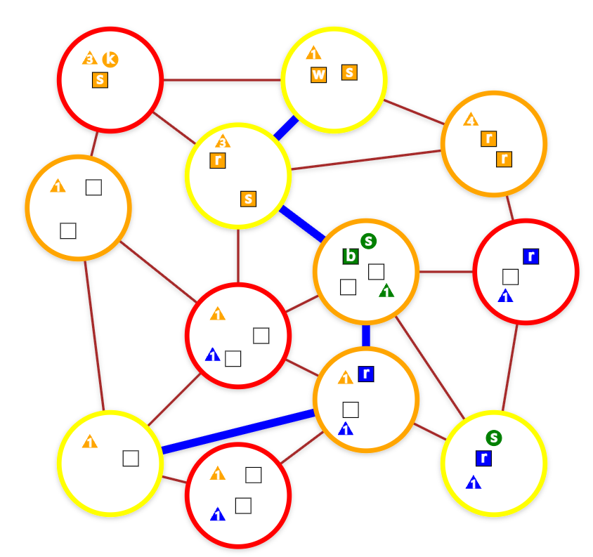
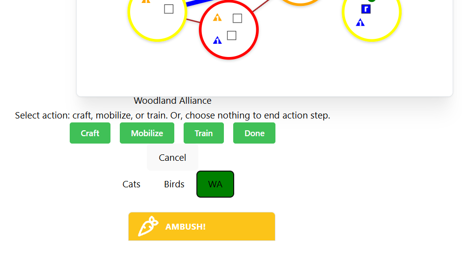
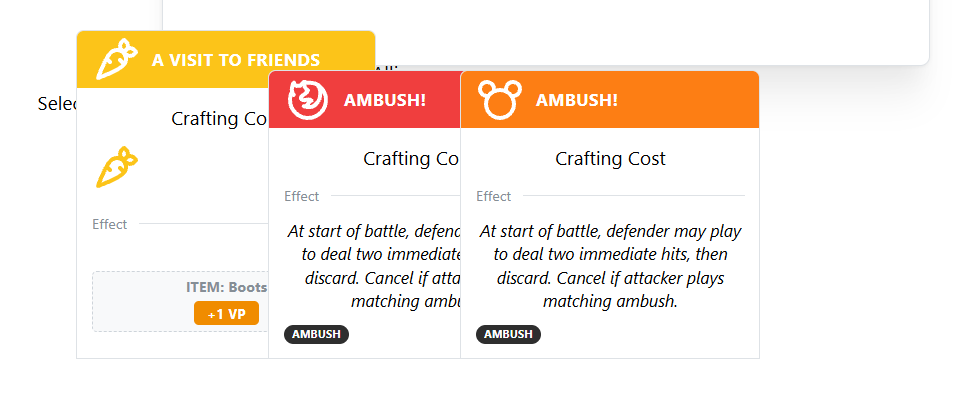
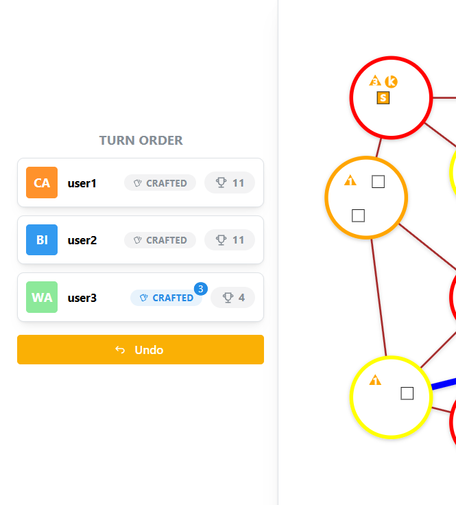
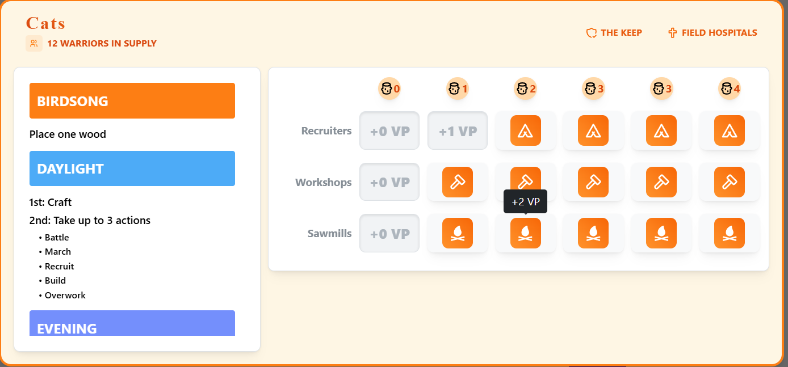
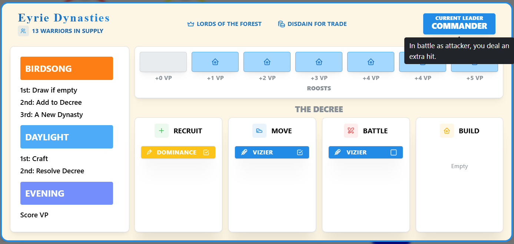
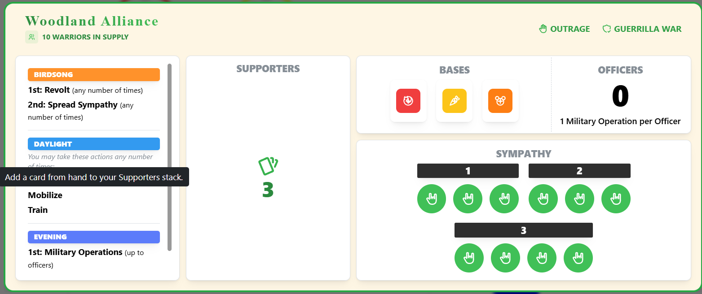

Table of Contents

- [Introduction](#introduction)
  - [Tech Stack and design philosophy](#tech-stack-and-design-philosophy)
    - [Project Structure](#project-structure)
    - [Action Flow](#action-flow)
  - [State of the Project](#state-of-the-project)
- [Running Locally/Development](#running-locallydevelopment)

# Introduction

This is a web-based adaptation of the board game Root by Cole Wehrle. Root is a complex board game with many different factions, each with their own unique rules and mechanics.

The eventual aim is to implement all current factions and one day, maybe fan-made factions as well.

A demo version of the game can be played at [https://root.mattdf.net/](https://root.mattdf.net/). Click a Demo User button to sign in and play around with any "ongoing" games, or go to the "create game" tab and click the Create Demo Game to quickly start a game with 3 factions. Within a game, use the faction control below the board to switch between users. The player info on the left of the screen can be clicked to bring up the player boards. The demo is not designed for mobile in mind. The demo usually runs smoothly, but it is on a cheap VM and sometimes the server might not have much compute which will make the demo crawl.

## Tech Stack and design philosophy

This project is built using Python and Django. The frontend is built using React and Tanstack Query for interaction with the API.

Real time updates are handled using django-channels and Redis.

The project is designed such that the server handles all game logic and the frontend handles all user interaction. The frontend will not be responsible for any game logic, as that would mean duplicating the logic in the frontend and backend in different languages, which is hard to maintain and likely to lead to bugs and inconsistencies.

The API is largely RPC-style, with endpoints for each player action. As the game objects are all intertwined, operating on individual "resources" is not practical within a single game. However, the API is "RESTful" in that it uses standard HTTP methods, status codes, token-based authentication, and JSON for data transfer.

### Project Structure

#### Backend

<ul>
<li> <b>Persistence Layer:</b> The database will hold all state for the game, which is defined in the models module.</li>
<li> <b>Selector Layer:</b> The queries module holds logic that queries the database, but does not modify it.</li>
<li><b>Service Layer:</b>The transactions module holds logic that modifies the database, checking for game state using queries.</li>
<li> <b>API Layer:</b> Views provide gamestate information and post methods to submit moves. These moves are validated (with queries) and then executed using transactions.</li>
</ul>

### Action Flow

The action flow relies on a metadata-driven client-server interaction. The server provides the client with details of data to send and where to send it, and the client uses this information to drive the UI and make requests. This means that the client never needs to know about the game logic, and the server never needs to know about the UI.

Here is a detailed look at the process:

<ul>
<li>The client requests the endpoint corresponding to the current action step, which may be a step of a player's turn, or resolving their part of an event like battle.</li>
<li>The client then makes a request of the provided endpoint, and receives a response detailing the instructions for the current action step, the data the client should send, and the endpoint to send it to.</li>

<li>
When the user interacts with the UI, the client packages the user's input into the data format provided by the server and sends it to the provided endpoint. If it is a multistep process, the server will validate the first step and send back the next one, or provide the error if the first step is invalid. This continues until the server sends back a "completed" step.
</li>
<li>
If the server sends back a "completed" step, the client will know that the action is complete (gamestate data is refetched and displayed). If not, the client receives a response corresponding to the next action step, and the cycle repeats until the action is completed.
</li>
<li>
Validation of timing and the player making requests is handled by the custom GameActionView base class. Anything corresponding to a player action is subclassed from this clas and validation can be customized as needed.
</li>
</ul>

## State of the Project

Games can be created and played, but right now there are only 3 factions: Cats, Birds, and Woodland Alliance. All basic game features are implemented and the core functions have been well tested. More factions will be added, more features will be provided, and the UI will be improved over time.

#### Implemented Features:

- Basic Setup Rules
- 3 factions have been fully implemented: Cats, Birds, and Woodland Alliance.
- Cards can be crafted.
  - Cards with passive effects are checked for and handled in the appropriate business logic.
  - Cards with active effects also work, launching events if the action has a narrow timing window or are simply made available when usable if they have a broader timing window.
- Game end conditions have been added.
- Game Browser to create, join, and switch between games.
- Undo functionality
- Dominance Conditions/Dominance Swapping

#### Not yet implemented:

- Game Logs (players should be able to scroll and see all public actions taken in the game)
- Woodland Alliance outrage: Need to provide the WA player with a widget to see any cards revealed by players who caused outrage but did not pay a card, and instead "revealed their hand". The data is saved in the database, but no display mechanism exists yet.
- Advanced Setup Rules (need to have enough factions implemented for this to be worthwhile)

### Frontend

The frontend is minimal, but will be augmented over time. Components such as cards and clearings are clickable and can be used to submit actions to the server.

#### MAP

Clearings are clickable for actions that require a clearing to be selected.



#### Action Prompter

Displays the current action step and the faction that needs to take an action. If options have been provided, they will be displayed as buttons that submit to the server.



#### Cards In Hand

Mousing over the hand of cards will expand them, and the hovered card will be brought to the front. Clicking a card will submit it to the server if relevant.



#### Player Badges

Player badges with facton, name, crafted cards, and score. Clicking a badge will show that player's board. Clicking crafted cards will display the crafted cards.


#### Player Boards

When a piece on a track covers information, that info is displayed in a tooltip.


Decree actions have a checkbox to indicate if the decree is used.

Only the woodland alliance player can see the details of their supporter stack.

# Running Locally/Development

## Prerequisites

- Python 3.10+
- Node.js
- Redis(optional)

## Setup

To run the project locally, I use npm and vite to serve the frontend and django to run the backend. the packages for the frontend are listed in the package.json file and the packages for the backend are listed in the requirements.txt file. To run the backend, you will need to be in the project root and run:

`python manage.py runserver`

The database is setup to run locally using sqlite3. You will need to run the initial migrations to set the database up before running the server the first time:

```
python manage.py makemigrations
python manage.py migrate
```

To run the frontend, you will need to be in the folder ./frontend and run:

`npm run dev`

If all goes well, the frontend will be available at http://localhost:5173.

In addition, Redis is used for the websocket connection to handle live updates. This isn't strictly needed for development but it may be a bit sluggish without it. The docker-compose.yml file is set up to run Redis locally in Docker and the app will be set up to use it automatically. If you have docker, at the root of this project folder run:

`docker-compose up -d`

to start the redis server.
